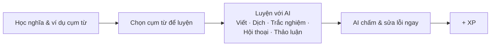
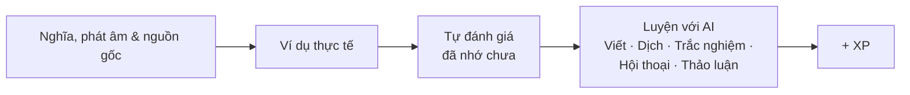
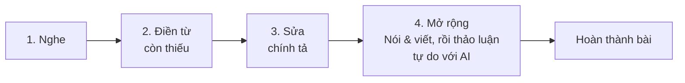
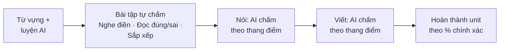

# Vocabulary Builder Pro

**Tài liệu giới thiệu sản phẩm, dành cho đối tác hợp tác marketing.**

Ứng dụng luyện tiếng Anh cho người Việt: từ vựng, thành ngữ, luyện nghe và IELTS nâng cao, cùng một AI luyện tập và chấm chữa như gia sư riêng, giữ người học quay lại mỗi ngày.

| Chỉ số | Nội dung |
| --- | --- |
| 49 | động từ nền tảng, cùng collocation và phrasal verb đi kèm |
| 300+ | thành ngữ tiếng Anh, trong 25 chủ đề |
| 25 | unit Cambridge IELTS Advanced, trình độ C1-C2 |
| A-Z | chủ đề nghe ngắn Listen A Minute |

---

## Vấn đề đang giải quyết

Phần lớn ứng dụng học từ vựng dừng lại ở flashcard: xem một từ, đoán nghĩa, lật thẻ. Người học nhớ từ đơn lẻ nhưng không biết dùng đúng cụm, đúng ngữ cảnh, và không có ai sửa câu họ viết ra hay chỉnh phát âm khi họ nói.

Vocabulary Builder Pro lấp đúng khoảng trống đó: nội dung học thuật thật (giáo trình Cambridge, kho thành ngữ, kho collocation) đi cùng một AI luyện tập, chấm điểm và sửa lỗi theo thời gian thực, cho từng câu và từng bài nói của riêng người học.

---

## Bốn mô-đun học chính

**Collocations & Phrasal Verbs.** 49 động từ tiếng Anh thông dụng nhất, nhóm theo nghĩa, cùng các collocation và phrasal verb đi kèm, để người học nhớ theo cụm chứ không học từ đơn lẻ.

**Idioms.** Hơn 300 thành ngữ trong 25 chủ đề: nghĩa song ngữ Anh-Việt, câu chuyện nguồn gốc, ví dụ thực tế, rồi luyện dịch để nhớ lâu.

**Listen A Minute.** Hàng loạt chủ đề nghe ngắn một phút, xếp từ A đến Z. Nghe, điền từ, sửa chính tả, rồi mở rộng sang luyện nói và luyện viết ngay trên cùng bài học.

**Cambridge Vocabulary for IELTS Advanced.** 25 unit bám sát giáo trình Cambridge IELTS Advanced (C1-C2): toàn bộ bài nghe, đọc, nói và từ vựng được số hoá thành trải nghiệm tương tác.

---

## Cấu trúc bài học từng mô-đun

Mỗi mô-đun có một luồng bài học riêng, không phải flashcard đồng nhất. Các sơ đồ dưới đây lấy trực tiếp từ luồng thao tác thật trong app.

### Collocations & Phrasal Verbs

Học theo cụm nghĩa xong, người học tự chọn một trong nhiều dạng luyện AI cho đúng cụm từ đó, được chấm và cộng XP ngay.

### Idioms

Học nghĩa và bối cảnh văn hoá trước, người học tự đánh giá mức nhớ, rồi mới vào luyện AI để khắc sâu thêm.

### Listen A Minute

Một quy trình 4 bước cố định cho mọi chủ đề: nghe, điền từ, sửa chính tả, rồi mở rộng sang nói, viết và thảo luận tự do với AI.

### Cambridge Vocabulary for IELTS Advanced

Số bước và thứ tự thay đổi theo từng unit, nhưng luôn mở đầu bằng từ vựng và thường kết ở phần nói, viết được AI chấm theo đúng thang điểm IELTS.

---

## Điểm khác biệt: một gia sư AI cho từng người học

Đây là phần lõi phân biệt Vocabulary Builder Pro với các app từ vựng thông thường: AI không chỉ tạo bài tập, mà tham gia hội thoại, chấm điểm và giải thích lỗi như một gia sư thật.

- **Converse & Discussion.** Người học hội thoại với AI theo kịch bản luyện cụm từ mục tiêu, hoặc trò chuyện tự do về chủ đề mở, không giới hạn đáp án đúng-sai.
- **Chấm điểm tức thì.** Mỗi câu luyện dịch, mỗi bài nói và bài viết đều được AI chấm điểm và giải thích rõ lỗi sai.
- **Một ngôn ngữ phản hồi duy nhất.** Người học tự chọn nhận phản hồi bằng tiếng Việt hoặc tiếng Anh, không bị trộn lẫn song ngữ gây rối.
- **Tra cứu tức thì.** Bôi đen bất kỳ đoạn văn nào trong app cũng tra được nghĩa từ vựng hoặc phân tích cấu trúc ngữ pháp ngay tại chỗ.
- **Không mất tiến trình.** Toàn bộ lịch sử luyện tập được lưu lại và đồng bộ, người học xem lại hoặc luyện tiếp bất cứ lúc nào, trên bất kỳ thiết bị nào.

---

## Gamification giữ chân người học

Mọi hoạt động AI đều thưởng điểm kinh nghiệm (XP) ngay khi hoàn thành. Thay vì mỗi mô-đun có một chuỗi ngày học riêng gây rối, cả ứng dụng dùng chung một con số streak: chỉ cần luyện ở bất kỳ mô-đun nào trong ngày là streak được tính. Trang chủ hiển thị streak, số từ đã lưu, tổng XP và biểu đồ hoạt động 7 ngày gần nhất ngay khi mở app, để người học luôn thấy mình đang tiến bộ.

---

## Mô hình kinh doanh đã vận hành thật

Mọi tài khoản được dùng thử miễn phí 7 ngày với toàn bộ tính năng mở khoá, không cần thẻ tín dụng. Sau đó, quyền truy cập tính theo thời gian đã mua, không phải một gói "Pro" cố định, gia hạn qua 4 mốc thời gian:

| Gói | Giá VND | Giá USD | Ghi chú |
| --- | --- | --- | --- |
| 1 tháng | 90.000 đ | $3.5 | Gói vào cửa |
| 3 tháng | 240.000 đ | $10 | |
| 6 tháng | 420.000 đ | $17 | |
| 12 tháng | 720.000 đ | $30 | Khoảng 2.000 đ/ngày, mức tốt nhất |

Thanh toán nội địa qua **PayOS** (VND) và quốc tế qua **PayPal** (USD) đã tích hợp, tự động, xác nhận qua webhook, không cần thao tác thủ công.

---

## Vì sao đây là kênh hợp tác phù hợp

- **Đăng nhập một chạm bằng Google**, dữ liệu đồng bộ trên chính Google Drive của người dùng: không lo mất dữ liệu khi đổi máy, không cần hạ tầng lưu trữ riêng cho từng đối tác.
- **Chia sẻ có sẵn cơ chế lan truyền.** Mọi kết quả luyện tập hay hội thoại AI đều tạo được thành link chia sẻ kèm ảnh xem trước, gửi thẳng qua Zalo, Messenger, WhatsApp ngay từ app, không cần chụp màn hình thủ công.
- **Có sẵn vị trí đặt thông điệp hợp tác.** Trang chủ, màn hình cài đặt và các màn hình luyện tập là những điểm chạm hằng ngày, sẵn sàng để giới thiệu ưu đãi hoặc nội dung phối hợp đúng lúc người học đang chủ động mở app.

---

## Liên hệ

Sẵn sàng gửi bản demo trực tiếp, số liệu chi tiết theo từng mô-đun, hoặc thảo luận hình thức hợp tác phù hợp.

**Email:** nguyencongnam506@gmail.com
